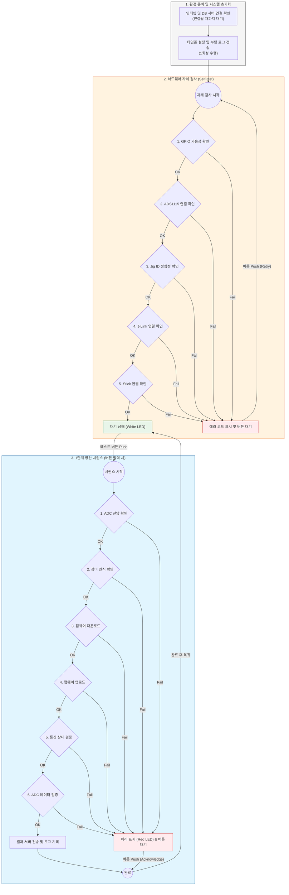

# 양산 프로그램 (Raspberry Pi Jig)
제품 양산용 지그 내부에 설치되는 **라즈베리파이**에서 동작하는 양산 프로그램 프로젝트입니다.  
기본 언어는 **Python**이며, 양산 프로세스는 총 3단계로 구성됩니다.

---

## 양산 프로세스(3단계)
- **1단계**: 제품 생산 및 기본검증
- **2단계**: 1차 검증
- **3단계**: 마지막 검증(최종 검증)

> 각 단계별 코드/실행 스크립트는 이 저장소에서 함께 관리합니다(구성은 추후 확정).

---

## 운영 환경
- **OS**: Ubuntu Server 24.04.3 LTS
- **Hostname**: `conalog-jig-<ID>` (ID는 15글자의 영문/숫자 혼합 식별자)
- **Remote Access**: Tailscale (클라우드 VPN을 통한 원격 SSH 접속)
- **Python**: 3.12+ (Ubuntu 24.04 기본 버전 권장)
- **하드웨어**: 릴레이 / 버튼 / RGB LED / TM1637 / ADS1115 / J-Link / Stick

---

## 빠른 시작 (Quick Setup)
Ubuntu Server 24.04.3 LTS 설치 직후, 아래 스크립트를 실행하여 필요한 모든 의존성(Tailscale, probe-rs, Python Venv 등)을 한 번에 설정할 수 있습니다.

```bash
# 1. 저장소 클론 (이미 되어 있다면 생략)
git clone <repository_url>
cd production_jig

# 2. 설정 스크립트 실행
./scripts/setup.sh
```
> [!IMPORTANT]
> 스크립트 실행 완료 후 반드시 **재부팅(`sudo reboot`)**이 필요합니다. 재부팅 후 `sudo tailscale up`을 통해 원격 접속을 활성화하세요.

---

## 실행 방법
이제 루트 디렉토리에 있는 `main.py`를 통해 모든 단계를 통합하여 실행할 수 있습니다. `configs/jig.json`의 `stage` 값에 따라 자동으로 해당 단계가 시작됩니다.

```bash
# 기본 설정(configs/jig.json)으로 실행
python3 main.py

# 특정 설정 파일을 지정하여 실행
python3 main.py --jig-config configs/jig_special.json
```

---

## 테스트 프레임워크 및 확장 가이드
모든 단계(1, 2, 3단계)의 테스트는 추상화된 구조를 따르며, 새로운 테스트 케이스를 쉽게 추가하고 관리할 수 있습니다.

### 전역 상태 관리 (`stageX/globals.py`)
테스트 과정에서 발견된 장치 정보나 공유 자원은 전역 변수를 통해 관리됩니다.
- `g.target_device`: 현재 테스트 중인 MLPE 장치 정보 (FICR, Address, Device ID, REQ_GET_INFO 결과 등). 시퀀스 시작 시마다 초기화됩니다.
- `g.bridge`: Solar Bridge와의 통신을 위한 `SolarBridgeClient` 객체. 앱 실행 시 한 번 생성되어 재사용됩니다.

### 테스트 케이스 구조 (`common/test_base.py`)
모든 테스트 클래스는 `TestCase` 추상 클래스를 상속받아 구현됩니다.
```python
class TestCase(ABC):
    @abstractmethod
    def run(self, args: dict[str, Any]) -> dict[str, Any]:
        # 결과는 {"code": int, "log": str} 형식의 dict로 반환
        pass
```

### 새로운 테스트 추가 방법
1. 해당 단계의 `steps.py` (또는 `self_test.py`)에 `TestCase`를 상속받는 클래스를 작성합니다.
2. `run()` 메서드 내에 로직을 구현합니다. 필요 시 `g.target_device`나 `g.bridge`를 활용합니다.
3. 시퀀스 실행 함수(예: `run_stage_test()`) 내의 `steps` 리스트에 해당 인스턴스를 추가합니다.

---

## 1단계(생산 및 기본검증) 상세 가이드

### 1-1. 전체 프로세스 흐름도


### 1-2. 자체 검사 (Self-test) 상세
부팅 직후 환경 준비 과정을 거쳐 자동으로 수행됩니다. 장비의 결함을 조기에 발견하여 양산 사고를 방지합니다.

- **Phase 1 (환경 준비)**: 인터넷 및 DB 서버 연결 확인 (실패 시 에러 코드 6, 7 표시)
- **Phase 2 (시스템 초기화)**: 타임존 설정 및 부팅 로그(`stage1.boot`) 1회 전송
- **Phase 3 (하드웨어 점검)**: GPIO, ADS1115, Jig ID, J-Link, Stick 연결 상태 확인
- **실패 시 처리**: 에러 코드를 표시하고 사용자의 재시도(버튼) 대기. 버튼 클릭 시 점검 단계만 재시작

### 1-3. 양산 시퀀스 상세 (버튼 동작)
자체 검사 통과 후(White LED) 사용자가 테스트 버튼을 누르면 시작됩니다.

1. **ADC 전압 확인**: ADS1115를 통해 보드의 12V 및 3.3V 전압이 정상 범위인지 확인
2. **장비 인식 확인**: `probe-rs`를 통한 nRF52810 칩셋 인식 및 FICR(DEVICEID, ADDR) 추출
3. **펌웨어 다운로드**: 서버에서 해당 `vendor`/`product`에 맞는 최신 바이너리(Bootloader, App) 획득
4. **펌웨어 업로드**: 장치 Flash 전체 Erase 후 펌웨어 스트리밍 라이팅
5. **통신 상태 검증**: 업로드된 장치와 `REQ_GET_INFO`를 통한 MQTT 명령/응답 테스트
6. **ADC 데이터 검증**: `DUMP_RAW_ADC` 명령을 통해 Vin1, Vin2, Vout 측정값이 오차 범위(20%) 내인지 확인
- **공통 사항**: 시퀀스 종료 시 모든 단계의 실행 로그가 집계되어 서버로 일괄 전송됩니다. 실패 시 빨간색 LED와 에러 코드가 유지되며 작업자의 버튼 확인 후 대기 상태로 복귀합니다.

### 1-4. 자동 실행 설정 (systemd)
```ini
[Unit]
Description=Factory Jig Stage1
After=network-online.target
Wants=network-online.target

[Service]
Type=simple
WorkingDirectory=/home/pi/양산_프로그램
ExecStart=/usr/bin/python3 main.py
Restart=on-failure
RestartSec=1

[Install]
WantedBy=multi-user.target
```

---

## 현재 포함된 모듈
하드웨어 제어 및 공통 유틸리티 구성입니다.

- `common/solar_bridge.py`: Solar Bridge(Go MQTT) 통신 클라이언트
- `common/db_server.py`: 로그 전송 및 데이터베이스 인터페이스
- `utils/ads1115.py`: ADC 측정 유틸
- `utils/button.py`: 물리 버튼 인터페이스
- `utils/rgb_led.py`: 상태 표시 LED 제어
- `utils/tm1637.py`: 7-seg 디스플레이 제어

---

## 설정 및 로깅
- **설정 파일**: `configs/jig.json` (ID, 단계, 제품 정보 등), `configs/io.json` (핀맵)
- **로깅 정책**: 
    - 로컬: `logs/stage1/YYYYMMDD/stage1.jsonl` (JSONL 포맷으로 실시간 기록)
    - 서버: `Self-test` 전체 또는 `Stage-test` 전체 완료 시점에 집계된 결과(`AggregatedResult`)를 한 번에 `push_log` 수행
- **캘리브레이션**: `configs/jig.json`의 `adc_scales` 필드를 통해 전압/전류 오프셋 조정

---

## 향후 과제 (참고)
- 2단계/3단계 검증 로직 구체화 및 통합
- 시스템 일괄 종료 및 업데이트 시나리오 보강
- 실제 장비 핀맵 최종 확정 및 문서화

