# 1단계(생산 및 기본검증) 상세 가이드

## 1-1. 전체 프로세스 흐름도

```mermaid
---
config:
  theme: mc
---
flowchart TD
    subgraph Boot_Phase["1. 환경 준비 및 시스템 초기화"]
        A1["인터넷 및 DB 서버 연결 확인 <br>(연결될 때까지 대기)"]
        A2["타임존 설정 및 부팅 로그 전송 <br>(1회성 수행)"]
        A1 --> A2
    end

    subgraph Self_Test_Phase["2. 하드웨어 자체 검사 (Self-test)"]
        direction TB
        B_Start((자체 검사 시작))
        
        B_GPIO{"1. GPIO 가용성 확인"}
        B_ADC{"2. ADS1115 연결 확인"}
        B_JigID{"3. Jig ID 정합성 확인"}
        B_JLink{"4. J-Link 연결 확인"}
        B_Stick{"5. Stick 연결 확인"}
        
        B_Fail["에러 코드 표시 및 버튼 대기"]
        B_Ready["대기 상태 (White LED)"]

        B_Start --> B_GPIO
        
        B_GPIO -- OK --> B_ADC
        B_ADC -- OK --> B_JigID
        B_JigID -- OK --> B_JLink
        B_JLink -- OK --> B_Stick
        B_Stick -- OK --> B_Ready

        B_GPIO -- Fail --> B_Fail
        B_ADC -- Fail --> B_Fail
        B_JigID -- Fail --> B_Fail
        B_JLink -- Fail --> B_Fail
        B_Stick -- Fail --> B_Fail

        B_Fail -- "버튼 Push (Retry)" --> B_Start
    end

    subgraph Production_Phase["3. 1단계 양산 시퀀스 (버튼 입력 시)"]
        direction TB
        C_Start((시퀀스 시작))
        C_Volt{"1. ADC 외부 전압 확인"}
        C_Recog{"2. 장비 인식 확인"}
        C_Down{"3. 펌웨어 다운로드"}
        C_Up{"4. 펌웨어 업로드"}
        C_Comm{"5. 통신 상태 검증"}
        C_ADC_Base{"6-1. ADC 확인 (Baseline)"}
        C_RSD1{"6-2. RSD1 ON"}
        C_ADC_RSD1{"6-3. ADC 확인 (RSD1)"}
        C_RSD2{"6-4. RSD1+2 ON"}
        C_ADC_RSD2{"6-5. ADC 확인 (RSD1+2)"}
        C_RSD_OFF{"6-6. RSD All OFF"}
        
        C_Result["결과 서버 전송 및 로그 기록"]
        C_Fail["에러 표시 (Red LED) & 버튼 대기"]
        C_Done((완료))

        C_Start --> C_Volt
        
        C_Volt -- OK --> C_Recog
        C_Recog -- OK --> C_Down
        C_Down -- OK --> C_Up
        C_Up -- OK --> C_Comm
        C_Comm -- OK --> C_ADC_Base
        C_ADC_Base -- OK --> C_RSD1
        C_RSD1 -- OK --> C_ADC_RSD1
        C_ADC_RSD1 -- OK --> C_RSD2
        C_RSD2 -- OK --> C_ADC_RSD2
        C_ADC_RSD2 -- OK --> C_RSD_OFF
        C_RSD_OFF --> C_Result
        
        C_Volt -- Fail --> C_Fail
        C_Recog -- Fail --> C_Fail
        C_Down -- Fail --> C_Fail
        C_Up -- Fail --> C_Fail
        C_Comm -- Fail --> C_Fail
        C_ADC_Base -- Fail --> C_Fail
        C_ADC_RSD1 -- Fail --> C_Fail
        C_ADC_RSD2 -- Fail --> C_Fail
        
        C_Fail -- "버튼 Push (Acknowledge)" --> C_Done
        C_Result --> C_Done
    end

    A2 --> B_Start
    B_Ready -- "테스트 버튼 Push" --> C_Start
    C_Done -- "완료 후 복귀" --> B_Ready

    style Boot_Phase fill:#f5f5f5,stroke:#333
    style Self_Test_Phase fill:#fff3e0,stroke:#e65100
    style Production_Phase fill:#e1f5fe,stroke:#01579b
    style B_Fail fill:#ffebee,stroke:#c62828
    style B_Ready fill:#e8f5e9,stroke:#2e7d32
    style C_Fail fill:#ffebee,stroke:#c62828
```

## 1-2. 자체 검사 (Self-test) 상세
부팅 직후 환경 준비 과정을 거쳐 자동으로 수행됩니다. 장비의 결함을 조기에 발견하여 양산 사고를 방지합니다.

- **Phase 1 (환경 준비)**: 인터넷 및 DB 서버 연결 확인 (실패 시 에러 코드 6, 7 표시)
- **Phase 2 (시스템 초기화)**: 타임존 설정 및 부팅 로그(`stage1.boot`) 1회 전송
- **Phase 3 (하드웨어 점검)**: GPIO, ADS1115, Jig ID, J-Link, Stick 연결 상태 확인
- **실패 시 처리**: 에러 코드를 표시하고 사용자의 재시도(버튼) 대기. 버튼 클릭 시 점검 단계만 재시작

## 1-3. 양산 시퀀스 상세 (버튼 동작)
자체 검사 통과 후(White LED) 사용자가 테스트 버튼을 누르면 시작됩니다.

1. **ADC 외부 전압 확인**: 지그에 설치된 ADS1115를 통해 보드에 인가된 12V 및 3.3V 외부 전압이 정상 범위인지 확인
2. **장비 인식 확인**: `probe-rs`를 통한 nRF52810 칩셋 인식 및 FICR(DEVICEID, ADDR) 추출
3. **펌웨어 다운로드**: 서버에서 해당 `vendor`/`product`에 맞는 최신 바이너리(Bootloader, App) 획득
4. **펌웨어 업로드**: 장치 Flash 전체 Erase 후 펌웨어 스트리밍 라이팅
5. **통신 상태 검증**: 업로드된 장치와 `REQ_GET_INFO`를 통한 MQTT 명령/응답 테스트
6. **ADC 데이터 검증 (Raw)**: `DUMP_RAW_ADC` 명령을 통해 MLPE 내부 ADC Raw 값이 설정 범위 내인지 확인
    - **Baseline**: 모든 RSD OFF 상태에서의 전압 확인
    - **RSD1**: RSD1만 작동 시 전압 변화 확인
    - **RSD1+2**: 모든 RSD 작동 시 전압 변화 확인
- **공통 사항**: 
    - 판정 기준은 `configs/adc_values.json`에서 통합 관리됩니다.
    - 모든 ADC 검증은 전압으로 변환되지 않은 **Raw ADC Count**를 기준으로 수행됩니다.
    - 시퀀스 종료 시 모든 단계의 실행 로그가 서버로 일괄 전송됩니다.
