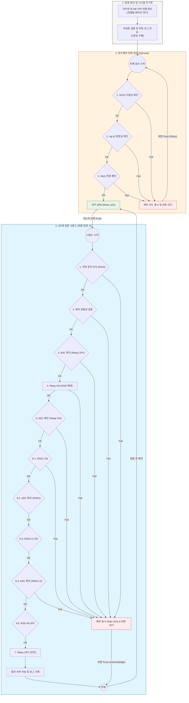

# 2단계(최종 조립 및 검증) 상세 가이드

## 2-1. 전체 프로세스 흐름도

## 2-2. 자체 검사 (Self-test) 상세
부팅 직후 환경 준비 과정을 거쳐 자동으로 수행됩니다. Stage 2에서는 J-Link 및 ADS1115 점검이 생략됩니다.

- **Phase 1 (환경 준비)**: 인터넷 및 DB 서버 연결 확인 (실패 시 에러 코드 6, 7 표시)
- **Phase 2 (시스템 초기화)**: 타임존 설정 및 부팅 로그(`stage2.boot`) 1회 전송
- **Phase 3 (하드웨어 점검)**: GPIO, Jig ID, Stick 연결 상태 확인
- **실패 시 처리**: 에러 코드를 표시하고 사용자의 재시도(버튼) 대기. 버튼 클릭 시 점검 단계만 재시작

## 2-3. 검증 시퀀스 상세 (버튼 동작)
사용자가 테스트 버튼을 누르면 시작됩니다. Stage 2는 펌웨어 업로드 과정이 없으며, 주변 장치 검색 및 MLPE ADC Raw 데이터 검증을 수행합니다.

1. **주변 장치 인식**: Neighbor List 초기화 후 일정 시간 대기, RSSI가 가장 낮은 장치를 타겟으로 자동 선택
2. **장비 정합성 검증**: 선택된 장치가 현재 테스트 대상 보드가 맞는지 추가 검증(자리 마련)
3. **ADC 확인 (Relay OFF)**: MLPE 내부 ADC Raw 값(Vin1, Vin2, Vout)이 설정된 범위 내에 있는지 확인
4. **Relay ON**: 지그의 릴레이를 활성화하여 제품에 전원을 인가하고 RSD 상태를 변경할 준비 수행
5. **ADC 확인 (Relay ON)**: 릴레이 활성화 직후의 ADC Raw 값 및 출력 전류(Iout) 확인
6. **RSD 상태별 검증**: MQTT 명령을 통해 MLPE의 내부 RSD 상태를 변경하며 전압 변화 확인
    - **RSD1 ON**: RSD1만 작동 시 전압 확인
    - **RSD1+2 ON**: 모든 RSD 작동 시 전압 확인
    - **RSD All OFF**: 모든 RSD 해제 상태로 복귀
7. **Relay OFF**: 테스트 종료 후 안전을 위해 지그 릴레이를 다시 비활성화
8. **결과 처리**: 모든 단계의 실행 로그를 서버로 전송
- **공통 사항**: 
    - 판정 기준은 `configs/adc_values.json`에서 통합 관리됩니다.
    - 모든 ADC 검증은 전압으로 변환되지 않은 **Raw ADC Count**를 기준으로 수행됩니다.
