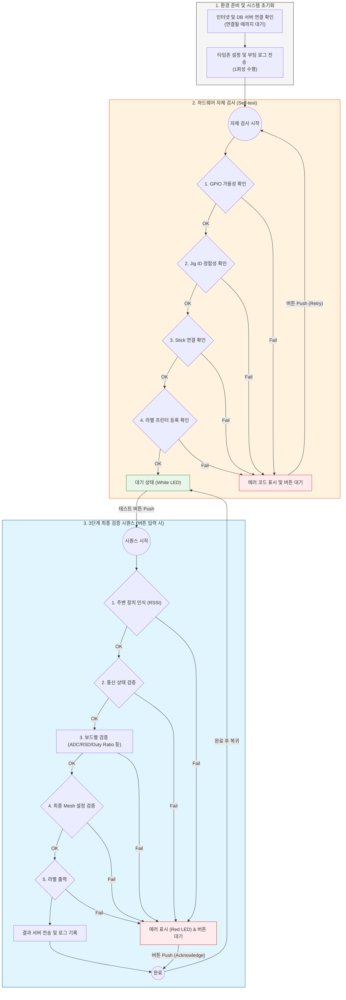

# 3단계(최종 검증 및 라벨 출력) 상세 가이드

## 3-1. 전체 프로세스 흐름도

## 3-2. 자체 검사 (Self-test) 상세
부팅 직후 환경 준비 과정을 거쳐 자동으로 수행됩니다. Stage 3에서는 라벨 프린터 등록 확인이 추가됩니다.

- **Phase 1 (환경 준비)**: 인터넷 및 DB 서버 연결 확인 (실패 시 에러 코드 6, 7 표시)
- **Phase 2 (시스템 초기화)**: 타임존 설정 및 부팅 로그(`stage3.boot`) 1회 전송
- **Phase 3 (하드웨어 점검)**: GPIO, Jig ID, Stick, Printer 연결 상태 확인
- **실패 시 처리**: 에러 코드를 표시하고 사용자의 재시도(버튼) 대기. 버튼 클릭 시 점검 단계만 재시작

## 3-3. 최종 검증 시퀀스 상세 (버튼 동작)
사용자가 테스트 버튼을 누르면 시작됩니다. Stage 3는 최종 Mesh 설정 검증과 라벨 출력이 추가됩니다.

Stage 2/3는 유선 연결이 없으므로 주변 장치가 뿌리는 **비콘 데이터**를 기반으로 대상을 선택합니다.  
선택 기준은 **Vendor/Product 타입** 일치 여부를 먼저 확인한 뒤 **RSSI**로 결정합니다.

1. **주변 장치 인식**: Neighbor List 초기화 후 일정 시간 대기, Vendor/Product 타입이 일치하는 장치 중 RSSI가 가장 높은 장치를 타겟으로 자동 선택
2. **통신 상태 검증**: `REQ_GET_INFO` 요청으로 응답/버전 확인 및 Upper ID 확보
3. **보드별 검증**: `stage3/boards/*.py`에 정의된 ADC/RSD/Duty Ratio 테스트 수행
4. **최종 Mesh 설정 검증**: 설정값을 읽어 기대치와 비교
5. **라벨 출력**: 프리셋(`configs/label_profiles.json`) 기반 ZPL 생성 후 프린터 출력
6. **결과 처리**: 모든 단계의 실행 로그를 서버로 전송
- **공통 사항**:
    - 판정 기준은 `configs/adc_values.json`에서 통합 관리됩니다.
    - 모든 ADC 검증은 전압으로 변환되지 않은 **Raw ADC Count**를 기준으로 수행됩니다.

## 3-4. 라벨 출력 설정
- **기본 프린터**: `ZD421` (Zebra)
- **프리셋**: `configs/label_profiles.json`
- **입력 데이터**: `configs/jig.json`의 `label` 필드(예: `preset`, `kc_no`, `authenticator`, `model`)

### 라벨 프리셋 선택 규칙
- `label.preset`가 존재하고 해당 키가 있으면 사용
- 없으면 `vendor_standard_label` (예: `conalog_standard_label`, `nanoom_standard_label`)
- 그것도 없으면 `conalog_standard_label`로 fallback

### 라벨 크기별 프리셋 구성 (현재)
- **conalog_standard_label**: 40mm × 25mm (300dpi)
  - 구성: QR 코드 단독(20mm)
- **nanoom_standard_label**: 70mm × 35mm (300dpi)
  - 구성: 디바이스 ID, 인증자/모델/제조년월, KC 마크/번호, 제조국, QR 코드

> 프리셋 상세 레이아웃은 `configs/label_profiles.json`의 `layout.items`에 정의됩니다.
